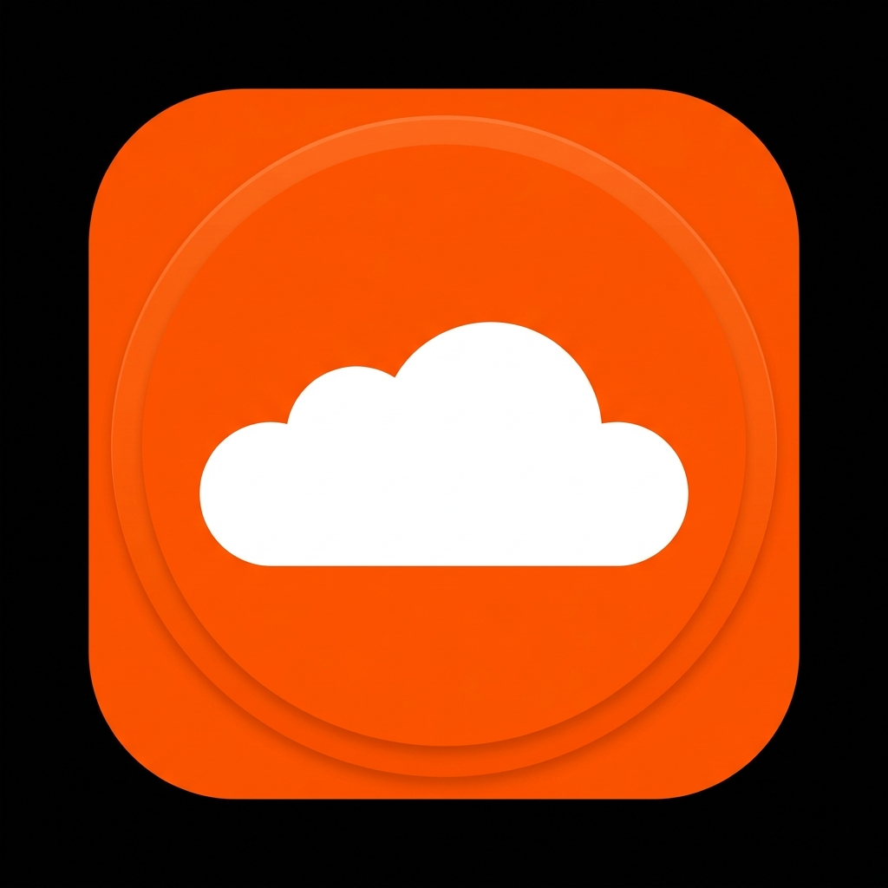

# SoundCloud Desktop Player

A desktop client for **SoundCloud** with Discord Rich Presence integration, MPRIS D-Bus controls, system tray support, and ad-blocking capabilities.



---

## ✨ Features

- 🎵 **Full SoundCloud Web Experience**: Built on QtWebEngine with bot-detection bypass.
- 🎧 **Discord Rich Presence**: Displays track title, artist name, elapsed/remaining time, artwork cover, and play/pause status in your Discord activity.
- 🎛️ **Linux MPRIS D-Bus Integration**: Full media keys support & compatibility with Linux desktop status bars/widgets (Waybar, Polybar, Noctalia, KDE Plasma, GNOME).
- 📌 **System Tray Integration**: Background playback, tray context menu with Play/Pause, Show/Hide Window, and Quit actions.
- 📋 **Copy Track Link**: Copy the currently playing song's URL directly to your clipboard from the tray menu.
- 🔍 **Keyboard Shortcut (`Ctrl + F`)**: Instantly focus and select SoundCloud's top search bar.
- 🔗 **External Browser Router**: Links in artist profiles (Instagram, Twitter, Spotify, etc.) and `gate.sc` redirects automatically open in your default desktop browser.
- 🛡️ **Built-in AdBlocker**: Suppresses audio & display promotions without breaking playback.
- 🚀 **Autostart / Minimized Launch**: Supports starting directly in the system tray via `--minimized` (`-m`).

---

## 🛠️ Usage & Running

### Using Nix Flake (Recommended)

Run directly with Nix:
```bash
nix run
```

Or install to your system profile:
```bash
nix profile install
```

### Development Shell

Start a development shell with all dependencies (`PySide6`, `pypresence`):
```bash
nix develop
python3 soundcloud_rpc.py
```

---

## ⚙️ Command-Line Flags

```text
usage: soundcloud-rpc [-h] [--minimized]

options:
  -h, --help        Show help message and exit
  --minimized, -m   Start application minimized to system tray
```

---

## 📄 License

MIT License.
